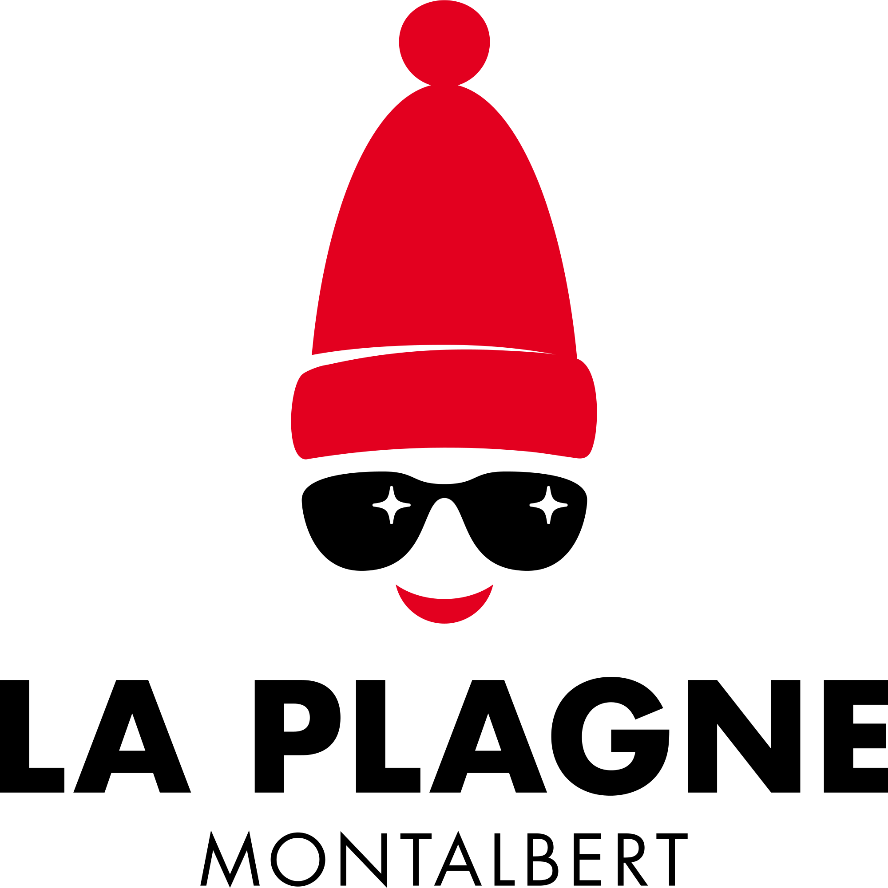
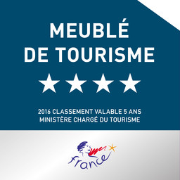
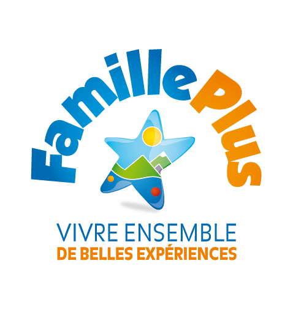


  
Un art de vivre contemporain à la montagne : tel est le principe qui a guidé la conception et la décoration du chalet Le Refuge de Montgésin, destiné à accueillir une tribu ou une famille de 10 personnes. Le chalet est labellisé Famille Plus et un kit bébé est mis à disposition gratuitement.  

Ce chalet indépendant est situé au-dessus de la station de Plagne Montalbert, à 1500 mètres d'altitude, dans le hameau de Montgésin qui abrite la chapelle baroque ND des Neiges.  

L’hiver, les skieurs rejoindront facilement la nouvelle télécabine de Montalbert assurant la liaison vers le domaine skiable de La Plagne – Paradiski. Le retour à ski se fait via la piste du Gentil selon l'enneigement. Le chalet est un point de départ pour de nombreuses explorations en raquettes, à ski de rando ou simplement à pied.  

L'été, les amateurs de balades à pied ou en VTT profiteront des sentiers vers Montalbert, ND du Pré ou le massif du Mont Jovet.  

Les contemplatifs se loveront dans les coussins de laine des banquettes intégrées dans la structure du chalet pour profiter du paysage.
Tous apprécieront le confort de la très belle pièce à vivre, des quatre chambres spacieuses, et des deux salles de bain de ce chalet classé 4 épis par les Gîtes de France.  


 

   
       
    
  	
  
  
  
  
  

